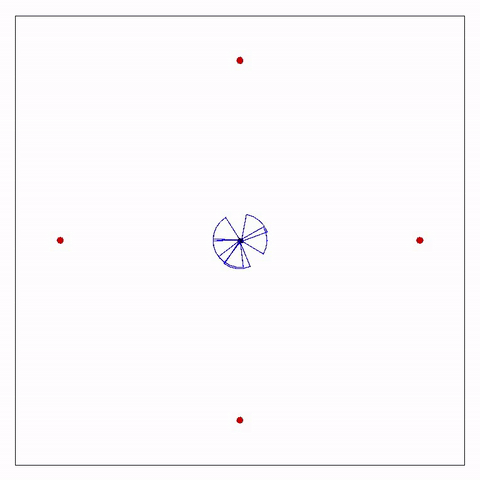
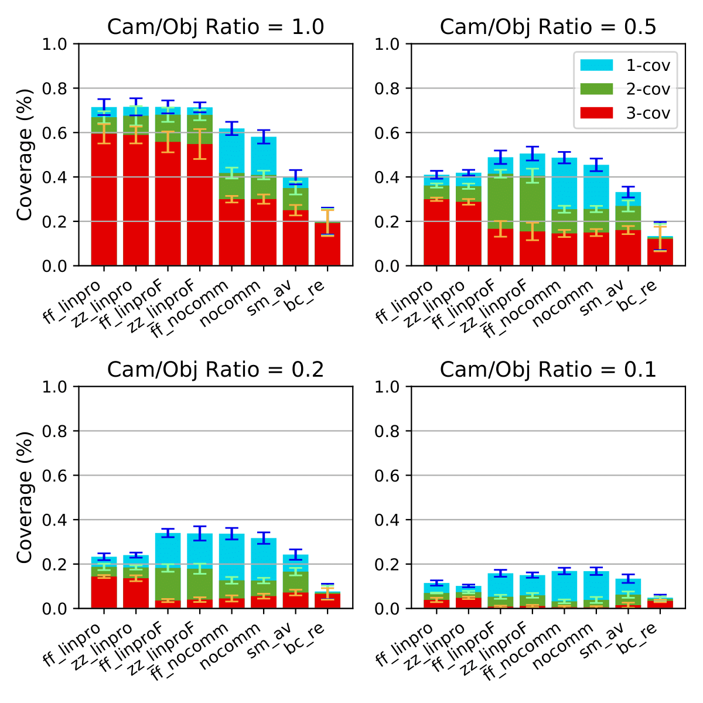
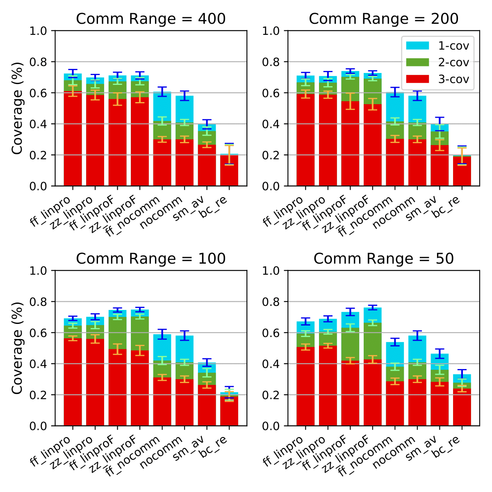

# Experiment-2019-Smartcam
- [Problem](#problem)
- [Solution](#solution)
- [Links](#links)
- [FF-LinPro showcase (LinPro with Force Field Exploration)](#ff-linpro-showcase-linpro-with-force-field-exploration)
- [Scenario of the simulations](#scenario-of-the-simulations)
  * [Evaluated algorithms](#evaluated-algorithms)
- [Results](#results)
  * [By varying the cam/obj ratio](#by-varying-the-cam-obj-ratio)
  * [By varying the communication range](#by-varying-the-communication-range)
- [Getting Started](#getting-started)
- [TODO](#todo)

## Problem
We have a set of mobile sensors (smartcameras) which can communicate and detect targets in their field of view. Our objective is to:
- Cover an area in which there may be moving targets.
- Maximize efficency and in particular the k-coverage. K-Coverage is reached for one target as long as it's being simultaneously observed by at least K sensors.

## Solution
Here are proposed 2 approaches: LinPro and Force Field Exploration (FF). The algorithms are decentralized and self-adapting. They naturally supports adding and removing sensors and targets during runtime.
Note: this project focuses on the *coordination*, security and vision related problems are not discussed.
### LinPro
This algorithm focuses on tracking targets and coordinating cameras to maximise performance.
The problem is modeled with linear programming: it achieves k-coverage while minimising the movements.

LinPro requires that sensors know their own position in space, and that they can calculate the position of the targets detected. The positions must be coherent and in reference to a common positioning system.

Each camera executes a 1-hop broadcast of its position and the positions of the targets seen. With the received data it solves the problem and follows the target indicated by the optimal solution.

### Force Field Exploration
This algorithm focuses on the coordinated exploration of the area.
This approach is inspired by ["Cooperative Multi-robot Observation
of Multiple Moving Targets"](https://doi.org/10.1109/ROBOT.1997.619270).

- Each camera produces a virtual repulsive force field.
- Each object (of which the position is known) produces a virtual attractive force field.
- Each camera has a "force of will" used to prevent the balancing of the forces, that would otherwise result in a static situation.
- The summation of the forces determine the direction of the camera. In this way the cameras tend to explore the arena homogeneously, while staying close to potential targets.

## References
- [A Development and Simulation Framework for Decentralised k-Coverage in Situated Multi-Robot Systems](https://github.com/DanySK/Paper-2019-PMC-SmartCam) - The paper originated from this experiment, it contains formal descriptions of all the mentioned algorithms and all the details involved in this work.
- [My thesis](https://amslaurea.unibo.it/19092/) - Contains the formulation of LinPro and all the details. In italian because of bureocracy... Interesting things from chapter 3, page 22
- [Online multi-object k-coverage with mobile smart cameras](https://doi.org/10.1145/3131885.3131909) - Contains the formal definition of k-coverage and some approaches for coordination algorithms
- [Alchemist Simulator](https://github.com/AlchemistSimulator/Alchemist) - The simulator used in this experiment
- [Protelis](http://protelis.github.io/) - The programming language based on "Aggregate Programming" used for the algorithms.

## FF-LinPro showcase (combination of LinPro and Force Field Exploration)

<!---
## Scenario of the simulations
| Variable                              | Default Value         |
|---------------------------------------|---------------|
| Duration of the simulation            | 600 s        |
| Size of the arena                     | 500 x 500 m   |
| Obj movement speed                    | 1.4 m/s       |
| Obj movement strategy                 | Lévy Walk     |
| Obj number                            | 100           |
| Definition of Target                  | (*)           |
| Obj / Cam ratio                       | 1             |
| Cam algorithm                         | NoComm        |
| Cam movement speed                    | 3 m/s         |
| Cam FoV distance                      | 30 m          |
| Cam FoV angle                         | 60 deg        |
| Cam rotation speed                    | π/5 rad/s     |
| Cam comm range                        | 800m          |
| Protelis' round frequency             | 1 Hz          |
| Max cams per target (k in k-coverage) | 3             |
| Seed                                  | 1             |

(*) Each object has 5% probability of becoming a target (red) every 20s. With the same strategy and probability it can stop being one (green).

### Evaluated algorithms
- FF-LinPro: LinPro with Force Field Exploration
- ZZ-LinPro: LinPro with "ZigZag" exploration
- FF-LinProF: Fair variant of LinPro
- ZZ-LinProF: Fair variant of LinPro
- BC-RE: Broadcast-ReceivedCalls from "Online multi-object k-coverage with mobile smart cameras"
- SM-AV: Smooth-Available from "Online multi-object k-coverage with mobile smart cameras"
- NoComm: Best effort without communication

## Results
The charts show the percentage of the time during which k-coverage was achieved. Error bars indicate the standard deviations.
### By varying the cam-obj ratio

### By varying the communication range

## Getting Started
<!---
I'm sorry, the code is a mess but finishing my thesis in time took the priority.
-->

Run `gradlew build` to compile.

`gradlew showcase_ff_linpro_from_center`  and `gradlew showcase_ff_linpro_generic`
 to run the simulations shown during the presentation.

`gradlew simulations` to run all the simulations used to produce the data shown in [the paper](https://github.com/DanySK/Paper-2019-PMC-SmartCam)

`python process.py` to produce the charts.
 

## TODO and notes
- Clean the mess
  - ~~ZigZagMove2 should be fixed in newer versions of Alchemist, if not then make a pr~~
  - ~~Same for LevyWalk~~
  - ~~AbstractConfigurableMoveNodeWithAccurateEuclideanDestination will then become useless and already included in Alchemist~~
  - ~~Make pr to Alchemist with the fixed version of ZigZagRandomTarget2, RandomTarget, and ChangeTargetOnCollision. Make tests, remove them from here~~
  - ~~CameraTargetAssignmentProblem (aka LinPro) handles the "fair" variant with.... commented code...~~
  - There is duplicated Protelis code for the linpro variants.
  - InitHeading should be removed, the initial heading should become a constructor parameter of CircleNode
  - ProtelisUtils is unreadable
- Improve performance of LinPro during simulations
  - ~~CachedCameraTargetAssignmentProblem doesn't work because cameras are not synchronized, find another method~~
  - Remember that the computational rounds are not synchronized.
  - The optimal solution for a round could probably be also the optimal solution for the next one, or a feasible one
  - If the set of targets and cameras hasn't changed since the previous round, the previous optimal solution could be assumed to still be the optimal one. This can be an approximation or an error, unless the speed of the drones is greater than that of the objects.
  - There exists faster algorithms than the simplex method to solve transportation problems. Hint: Kramer's theorem using determinants of the submatrixes of the coefficients' one?
